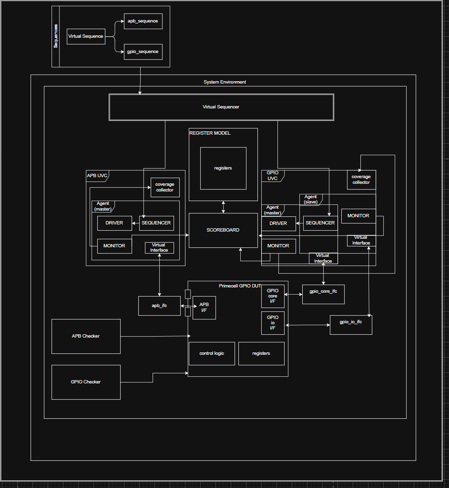

# PL061 GPIO UVM Verification

## Project Overview
APB 기반 PL061 GPIO IP를 대상으로 한 UVM 검증 환경 구축

## Verification Environment
- APB UVC
- GPIO UVC
- Virtual Sequence
- UVM RAL
- Scoreboard
- SVA Checker
- Functional Coverage

## Verification Features
- Register read/write verification
- Read-only / Write-only / Reserved access verification
- GPIO interrupt verification
- Rising / Falling / Both Edge
- High / Low level detection
- Corner case sequence
- Register access coverage
- FSM / Branch coverage

## Testbench Architecture

## Debugging
주요 검증 과정에서 발견한 DUT/Scoreboard timing mismatch 및
SystemVerilog scheduling 문제를 분석하고 수정함.

## Result
- Register verification: PASS
- APB protocol assertion: PASS
- GPIO functional verification: PASS
- Coverage: XX%
